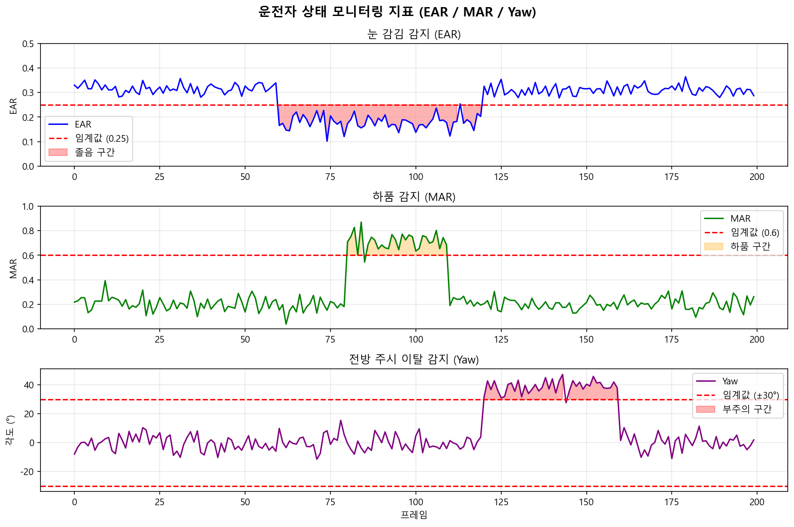

# Driver Monitoring System (DMS) Agent

> MediaPipe + YOLOv8 + LangGraph 기반 실시간 운전자 상태 모니터링 시스템

---

## 프로젝트 목적

졸음운전과 부주의 운전은 교통사고의 주요 원인 중 하나입니다.  
이 프로젝트는 웹캠/차량 카메라로부터 실시간 영상을 받아 운전자의 상태를 자동으로 감지하고 경고를 출력하는 AI 시스템입니다.

단순 규칙 기반 임계값이 아닌 **LangGraph 멀티에이전트**가 복합 신호를 통합 판단하는 구조를 채택했습니다.

---

## 시스템 구조

```
웹캠 / 차량 카메라
        │
        ▼
  Frame Processor
  (프레임 전처리)
        │
   ┌────┴─────────────────┐
   ▼                       ▼
Face Analysis Agent    Object Detection Agent
┌──────────────────┐   ┌───────────────────┐
│ MediaPipe        │   │ YOLOv8            │
│ - EAR (눈 감김) │   │ - 휴대폰 감지     │
│ - MAR (하품)    │   │ - 담배 감지       │
│ - Head Pose     │   │ - 기타 위험 객체  │
│ - PERCLOS       │   └────────┬──────────┘
└────────┬─────────┘            │
         └──────────┬───────────┘
                    ▼
         State Classifier Agent
         (다중 신호 통합 판단)
                    │
                    ▼
         LLM Reasoning Agent (Ollama)
         상황 맥락 이해 + 경고 메시지 생성
                    │
                    ▼
         Alert Manager Agent
         ┌─────────────────────────────┐
         │ Level 1 — 주의 (경고음)    │
         │ Level 2 — 위험 (강한 경보) │
         │ Level 3 — 즉시 정지 요청  │
         └─────────────────────────────┘
```

---

## 핵심 알고리즘

### EAR (Eye Aspect Ratio) — 눈 감김 감지

```
EAR = (|p2-p6| + |p3-p5|) / (2 × |p1-p4|)
→ EAR < 0.25 이면 눈 감김으로 판단
```

### MAR (Mouth Aspect Ratio) — 하품 감지

```
MAR = (|p2-p8| + |p3-p7| + |p4-p6|) / (2 × |p1-p5|)
→ MAR > 0.60 이면 하품으로 판단
```

### PERCLOS — 졸음 판단

```
PERCLOS = (단위 시간 내 눈 감긴 프레임 수) / (전체 프레임 수)
→ PERCLOS > 0.15 이면 졸음 상태
```

---

## 기술 스택

| 영역 | 기술 |
|------|------|
| 얼굴 추적 | MediaPipe Face Mesh |
| 객체 감지 | YOLOv8 (휴대폰, 담배 등) |
| 에이전트 프레임워크 | LangGraph StateGraph |
| LLM (경고 메시지 생성) | Ollama (로컬, 무료) |
| API 서버 | FastAPI |
| 배포 | Docker |

---

## 모니터링 지표 시각화

실시간으로 추적하는 3가지 핵심 지표 — EAR(눈 감김), MAR(하품), Yaw(고개 방향)



---

## 경고 레벨

| 레벨 | 조건 | 대응 |
|------|------|------|
| **Level 1 — 주의** | EAR < 0.25 (3초 이하) 또는 고개 숙임 | 경고음 + 화면 알림 |
| **Level 2 — 위험** | PERCLOS > 0.15 또는 휴대폰 감지 | 강한 경보 + 진동 |
| **Level 3 — 즉시 정지** | 복합 이상 (졸음 + 고개 방향 이탈) | 비상 경고 + 관제 전송 |

---

## 실행 방법

### 1. 환경 설정

```bash
git clone https://github.com/MJHolics/dms-agent.git
cd dms-agent

pip install -r requirements.txt
```

**Ollama 설치 (LLM 로컬 실행):**
```bash
# https://ollama.ai 에서 설치 후
ollama pull qwen2.5:7b
ollama serve
```

### 2. 로컬 실행

```bash
# FastAPI 서버
python run_server.py

# → http://localhost:8000/docs
```

### 3. Docker 실행

```bash
docker-compose up --build
```

---

## API

### `POST /analyze/frame`

웹캠 프레임(Base64)을 전송하면 운전자 상태를 분석합니다.

**Request:**
```json
{
  "frame_b64": "<base64 encoded image>",
  "frame_id": 42
}
```

**Response:**
```json
{
  "alert_level": 2,
  "severity": "danger",
  "message": "졸음 감지: PERCLOS 0.18, 눈 감김 지속 중. 즉시 휴식을 취하세요.",
  "details": {
    "ear": 0.21,
    "mar": 0.45,
    "perclos": 0.18,
    "head_pose": "정면",
    "objects_detected": [],
    "face_detected": true
  },
  "elapsed_ms": 34.2
}
```

---

## 노트북 구성

| 노트북 | 내용 |
|--------|------|
| `01_mediapipe_basics.ipynb` | MediaPipe Face Mesh, EAR/MAR/Head Pose 기초 |
| `02_drowsiness_detection.ipynb` | PERCLOS 알고리즘, YOLOv8 객체 감지 통합 |
| `03_langgraph_agents.ipynb` | LangGraph StateGraph 에이전트 구성 |
| `04_full_pipeline.ipynb` | 전체 파이프라인 통합 및 실시간 테스트 |

---

## 프로젝트 구조

```
dms-agent/
├── agents/
│   └── pipeline.py          # LangGraph 멀티에이전트 파이프라인
├── api/
│   ├── main.py              # FastAPI 엔트리포인트
│   └── models.py            # Pydantic 요청/응답 스키마
├── notebooks/
│   ├── 01_mediapipe_basics.ipynb
│   ├── 02_drowsiness_detection.ipynb
│   ├── 03_langgraph_agents.ipynb
│   └── 04_full_pipeline.ipynb
├── models/                  # YOLOv8 가중치 파일
├── data/test_videos/        # 테스트 영상
├── Dockerfile
├── docker-compose.yml
└── requirements.txt
```

---

## 기술 선택 이유

- **MediaPipe**: 경량 Face Mesh로 CPU에서도 30fps 실시간 처리 가능
- **YOLOv8**: 단일 모델로 휴대폰, 담배 등 다양한 위험 객체 감지
- **LangGraph**: 단순 if-else 경고가 아닌 에이전트가 복합 상황을 판단하도록 설계
- **Ollama**: API 비용 없이 로컬에서 LLM 추론 (RTX 4080 Super 활용)

---

## 개발자

**MJHolics** — 자율주행 파이프라인 경험을 바탕으로 차량 내 AI 시스템(DMS)을 LangGraph 에이전트 구조로 구현.
