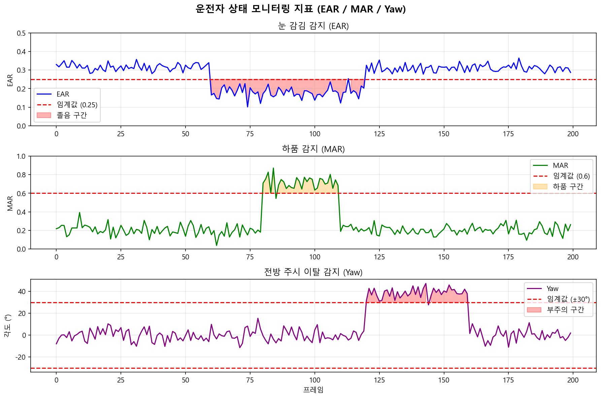
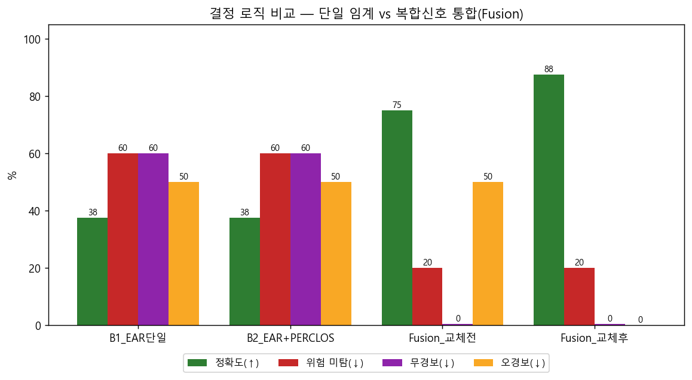
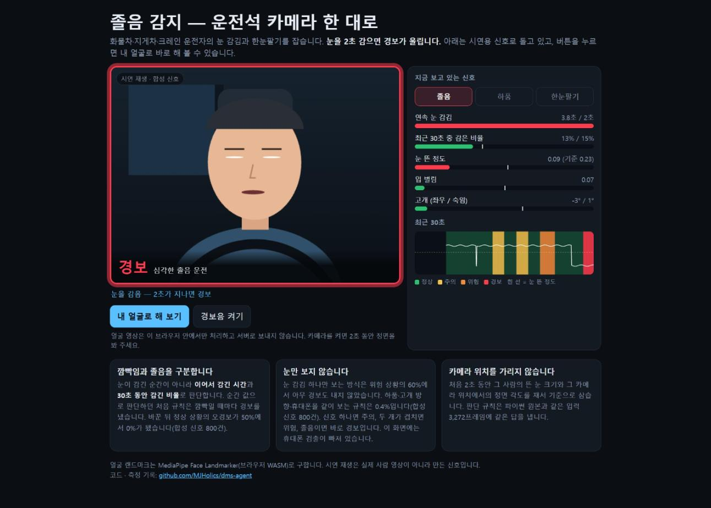

# Driver Monitoring System (DMS) Agent

> MediaPipe + YOLOv8 + LangGraph 기반 실시간 운전자 상태 모니터링 시스템

---

## 프로젝트 목적

졸음운전과 부주의 운전은 교통사고의 주요 원인 중 하나입니다.  
이 프로젝트는 웹캠/차량 카메라로부터 실시간 영상을 받아 운전자의 상태를 자동으로 감지하고 경고를 출력하는 AI 시스템입니다.

단순 규칙 기반 임계값이 아닌 **LangGraph 멀티에이전트**가 복합 신호를 통합 판단하는 구조를 채택했습니다.

---

## 시스템 구조

```
웹캠 / 차량 카메라
        │
        ▼
  Frame Processor
  (프레임 전처리)
        │
   ┌────┴─────────────────┐
   ▼                       ▼
Face Analysis Agent    Object Detection Agent
┌──────────────────┐   ┌───────────────────┐
│ MediaPipe        │   │ YOLOv8            │
│ - EAR (눈 감김) │   │ - 휴대폰 감지     │
│ - MAR (하품)    │   │ - 담배 감지       │
│ - Head Pose     │   │ - 기타 위험 객체  │
│ - PERCLOS       │   └────────┬──────────┘
└────────┬─────────┘            │
         └──────────┬───────────┘
                    ▼
         State Classifier Agent
         (다중 신호 통합 판단)
                    │
                    ▼
         LLM Reasoning Agent (Ollama)
         상황 맥락 이해 + 경고 메시지 생성
                    │
                    ▼
         Alert Manager Agent
         ┌─────────────────────────────┐
         │ Level 1 — 주의 (경고음)    │
         │ Level 2 — 위험 (강한 경보) │
         │ Level 3 — 즉시 정지 요청  │
         └─────────────────────────────┘
```

---

## 핵심 알고리즘

### EAR (Eye Aspect Ratio) — 눈 감김 감지

```
EAR = (|p2-p6| + |p3-p5|) / (2 × |p1-p4|)
→ EAR < 0.25 이면 눈 감김으로 판단
```

### MAR (Mouth Aspect Ratio) — 하품 감지

```
MAR = (|p2-p8| + |p3-p7| + |p4-p6|) / (2 × |p1-p5|)
→ MAR > 0.60 이면 하품으로 판단
```

### PERCLOS — 졸음 판단

```
PERCLOS = (단위 시간 내 눈 감긴 프레임 수) / (전체 프레임 수)
→ PERCLOS > 0.15 이면 졸음 상태
```

---

## 기술 스택

| 영역 | 기술 |
|------|------|
| 얼굴 추적 | MediaPipe Face Mesh |
| 객체 감지 | YOLOv8 (휴대폰, 담배 등) |
| 에이전트 프레임워크 | LangGraph StateGraph |
| LLM (경고 메시지 생성) | Ollama (로컬, 무료) |
| API 서버 | FastAPI |
| 배포 | Docker |

---

## 모니터링 지표 시각화

실시간으로 추적하는 3가지 핵심 지표 — EAR(눈 감김), MAR(하품), Yaw(고개 방향)



---

## 경고 레벨

| 레벨 | 조건 | 대응 |
|------|------|------|
| **Level 1 — 주의** | EAR < 0.25 (3초 이하) 또는 고개 숙임 | 경고음 + 화면 알림 |
| **Level 2 — 위험** | PERCLOS > 0.15 또는 휴대폰 감지 | 강한 경보 + 진동 |
| **Level 3 — 즉시 정지** | 복합 이상 (졸음 + 고개 방향 이탈) | 비상 경고 + 관제 전송 |

---

## 결정 로직 벤치마크 — 왜 복합신호 통합인가 (실측)

"단순 임계가 아니라 복합신호를 통합한다"는 주장을 수치로 검증했습니다. 지각(MediaPipe/YOLO)이
아니라 **결정 계층**(`state_classifier` + `alert_manager`)을 평가 단위로 잡고, 실제 코드를 그대로
라벨된 운전 상황 800개(8상황×100, seed 고정)에 태웠습니다. 정답은 융합 공식이 아니라 **안전 관점의
독립 스펙**으로 정의했습니다.

```bash
python tools/bench_fusion.py   # → reports/fusion_bench.{json,png}
```

| 판정기 | 정확도 | **무경보**(위험을 아예 못 알림) | 오경보(정상에 경보) |
|--------|--------|------------------------------|--------------------|
| EAR 단일 임계 (교과서적 졸음 감지) | 37.5% | **60.0%** | 50.0% |
| EAR + PERCLOS | 37.5% | 60.0% | 50.0% |
| **복합신호 통합 (본 시스템)** | **87.5%** | **0.4%** | **0.0%** |

- 단일 임계는 눈만 봅니다 → 주의산만·휴대폰처럼 **눈은 뜬 위험의 60%에 경보를 안 냅니다.**
  통합 판단은 고개(yaw/pitch)·객체를 함께 봐 이를 0.4%로 낮춥니다.
- 이 벤치마크로 통합 로직 자체의 **순간 깜빡임 오경보(50%)**를 발견해, `is_drowsy`를 단발 EAR이
  아닌 **PERCLOS 지속** 기준으로 교체 → 오경보 50%→0%, 정확도 75%→87.5%. 교체 전 로직도
  벤치마크에 남겨 before/after가 한 번의 실행으로 재현됩니다.
- **한계(정직하게)**: 라벨은 실주행 영상이 아닌 안전 스펙 기반 합성 시나리오이며, 통합 로직도
  단독 주의산만은 L1로 과소평가해 위험미탐 20%가 남습니다.



---

## 브라우저판 — 링크를 열면 바로 해 보는 졸음 감지 (`web/`)

**바로 해 보기: https://mjholics.github.io/dms-agent/** (카메라가 없어도 시연 재생이 돈다)



화물차·지게차·크레인 운전석을 떠올리고 만든 화면이다. 열면 시연용 신호로 한 바퀴가 저절로 돌고(깜빡임 → 하품 → 옆 보기 → 2초 감김),
「내 얼굴로 해 보기」를 누르면 카메라로 같은 판단이 돈다. 설치·서버·GPU가 없다. 얼굴 랜드마크는 MediaPipe Face Landmarker(WASM)로 브라우저 안에서 구한다.

```bash
cd web && python -m http.server 8765     # http://127.0.0.1:8765
node --test web/tests                    # 파이썬 원본 대조 8개 + 시연 재생 4개
python tools/export_parity_fixture.py    # 규칙을 바꿨을 때 정답 파일 다시 만들기
```

**판단 규칙의 원본은 파이썬(`agents/decision.py`)이고 `web/decision.js`는 그 이식본이다.** 파이썬이 낸 답을 정답 파일로 떠서 JS에 같은 입력을 태워 대조한다.

| 대조 항목 | 건수 | 결과 |
|---|---|---|
| EAR·MAR 계산 | 200 | 일치(오차 1e-9 이내) |
| 변환 행렬 → 고개 각도 | 200 | 일치 |
| 신호 → 위험 플래그 → 경보 레벨(기존 벤치 800건 + 경계값 200건) | 1,000 | 일치 |
| 시간 누적까지 포함한 시퀀스 5개(8~60fps, 프레임 간격 불규칙) | 3,272프레임 | 전 항목 일치 |
| 같은 사진을 파이썬·브라우저 MediaPipe에 넣었을 때(1장) | EAR 0.3124/0.3123 · 숙임 14.92°/14.99° · MAR 0.221/0.248 · 좌우 -0.29°/0.40° | 근사 |

### 옮기면서 찾은 것 (교체·에러 기록)

실제 얼굴 사진 한 장을 원본 파이프라인에 넣어 보고 나서야 드러난 문제들이다. 기존 벤치는 합성 신호로 결정 계층만 쟀기 때문에 지각 계층의 결함을 보지 못했다.

| 문제 | 증상(정면·입 다문 사진 1장) | 원인 | 고친 방법 |
|---|---|---|---|
| 고개 각도 | pitch -52,628° · yaw -1,705° → 한눈팔기가 항상 켜짐 | solvePnP 결과(이미 도 단위)에 360을 곱함 | FaceLandmarker의 얼굴 변환 행렬에서 정면 벡터를 읽음 → 14.9° · -0.3° |
| 하품(MAR) | 0.998 → 하품이 항상 켜짐 | 입 랜드마크 8점의 순서가 공식과 안 맞음 | 입 안쪽 윤곽 순서로 교체 → 0.221 |
| 모델 로드 | 한글이 든 절대 경로에서 로드 실패 | mediapipe 네이티브 쪽이 경로를 못 엶 | 파일을 바이트로 읽어 넘김 |
| PERCLOS 창 | 프레임 900개 고정 → fps에 따라 창 길이가 달라지고, 시작 직후엔 깜빡임 한 번이 15%를 넘김 | 프레임 수로 셈 | 시각(초)으로 누적, 아직 안 본 구간은 뜬 눈으로 침 |
| 고정 임계 | 정면을 본 사진인데 숙임 14.9°(임계 20°) | 카메라가 얼굴 정면에 있지 않음 | 처음 2초의 중앙값을 기준 자세·뜬 눈 크기로 삼음 |
| 경보 조건 | 2초를 감아도 30초 창에서는 6.7%라 경보가 안 남 | 누적 비율만 봄 | 연속 감김 2초 조건 추가 |

고친 뒤 원본 파이프라인의 같은 사진 판정은 정상(레벨 0)이고, 결정 계층 벤치 수치는 그대로다(87.5% · 무경보 0.4% · 오경보 0%).

### 아직 확인하지 않은 것

- 카메라 모드는 사진 1장으로 랜드마크 경로만 확인했다. 실제 얼굴로 눈 감김·하품·고개 돌림 임계가 맞는지는 기기에서 봐야 한다(안경·조명·휴대폰 화각).
- 보정 비율(뜬 눈 EAR의 75%)과 하품 임계 0.60은 초기값이다. 사람 데이터로 정한 값이 아니다.
- 브라우저판에는 휴대폰 검출(YOLO)이 없다. 파이썬 `/analyze` 경로의 PERCLOS는 아직 프레임 수 창이다.

## 실행 방법

### 1. 환경 설정

```bash
git clone https://github.com/MJHolics/dms-agent.git
cd dms-agent

# mediapipe 0.10.x는 mp.solutions API 없음 → 0.9.x 필수
pip install -r requirements.txt
```

**Ollama 설치 (LLM 로컬 실행, 선택사항):**
```bash
# https://ollama.com 에서 설치 후
ollama pull qwen2.5:7b
ollama serve
# 미설치 시 Rule-based 경고 메시지로 자동 폴백
```

### 2. 로컬 실행

```bash
# FastAPI 서버
python run_server.py

# → http://localhost:8000/docs
```

### 3. Docker 실행

```bash
docker-compose up --build
```

---

## API

Swagger UI: `http://localhost:8000/docs`

### `GET /health`

```json
{"status": "ok", "service": "DMS Agent"}
```

### `POST /analyze`

이미지 파일을 multipart/form-data로 전송하면 운전자 상태를 분석합니다.

**Request:**
```bash
curl -X POST http://localhost:8000/analyze \
     -F "file=@frame.jpg"
```

**Response:**
```json
{
  "frame_id": 42,
  "face_detected": true,
  "ear": 0.21,
  "mar": 0.45,
  "yaw": 5.2,
  "pitch": 3.1,
  "perclos": 0.18,
  "detected_objects": [],
  "is_drowsy": true,
  "is_yawning": false,
  "is_distracted": false,
  "has_danger_obj": false,
  "alert_level": 2,
  "alert_reason": "복합 위험 신호",
  "llm_message": "위험 신호가 감지되었습니다! 잠시 휴식을 권장합니다.",
  "inference_ms": 34.2
}
```

---

## 노트북 구성

| 노트북 | 내용 |
|--------|------|
| `01_mediapipe_basics.ipynb` | MediaPipe Face Mesh, EAR/MAR/Head Pose 기초 |
| `02_drowsiness_detection.ipynb` | PERCLOS 알고리즘, YOLOv8 객체 감지 통합 |
| `03_langgraph_agents.ipynb` | LangGraph StateGraph 에이전트 구성 |
| `04_full_pipeline.ipynb` | 전체 파이프라인 통합 및 실시간 테스트 |

---

## 프로젝트 구조

```
dms-agent/
├── agents/
│   └── pipeline.py          # LangGraph 멀티에이전트 파이프라인
├── api/
│   ├── main.py              # FastAPI 엔트리포인트
│   └── models.py            # Pydantic 요청/응답 스키마
├── notebooks/
│   ├── 01_mediapipe_basics.ipynb
│   ├── 02_drowsiness_detection.ipynb
│   ├── 03_langgraph_agents.ipynb
│   └── 04_full_pipeline.ipynb
├── models/                  # YOLOv8 가중치 파일
├── data/test_videos/        # 테스트 영상
├── Dockerfile
├── docker-compose.yml
└── requirements.txt
```

---

## 기술 선택 이유

- **MediaPipe**: 경량 Face Mesh로 CPU에서도 30fps 실시간 처리 가능
- **YOLOv8**: 단일 모델로 휴대폰, 담배 등 다양한 위험 객체 감지
- **LangGraph**: 단순 if-else 경고가 아닌 에이전트가 복합 상황을 판단하도록 설계
- **Ollama**: API 비용 없이 로컬에서 LLM 추론 (RTX 4080 Super 활용)

---

## 개발자

**MJHolics** — 자율주행 파이프라인 경험을 바탕으로 차량 내 AI 시스템(DMS)을 LangGraph 에이전트 구조로 구현.
